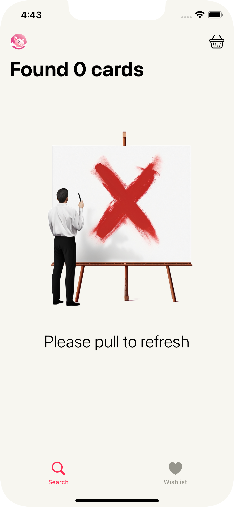
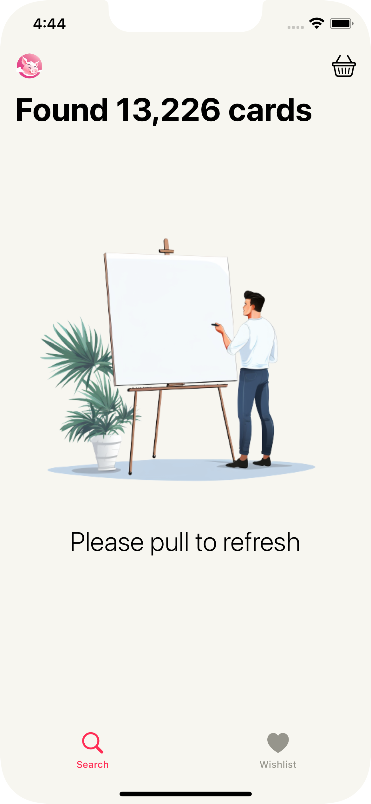
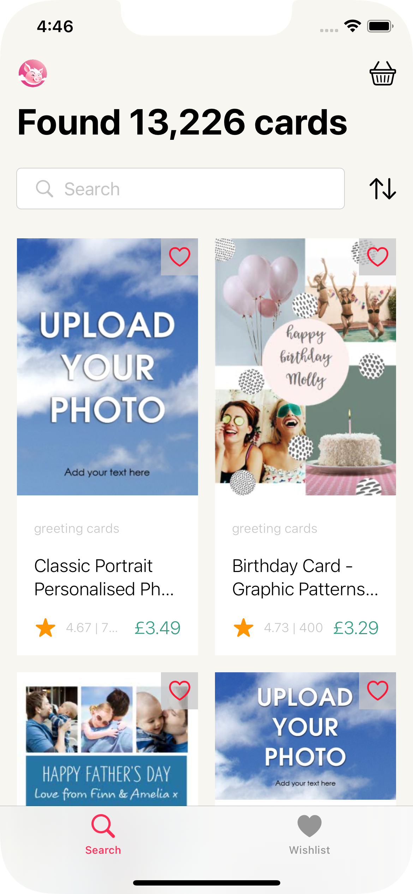
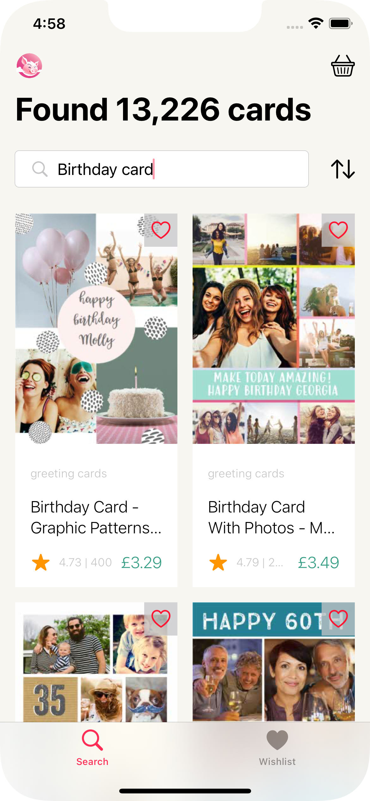
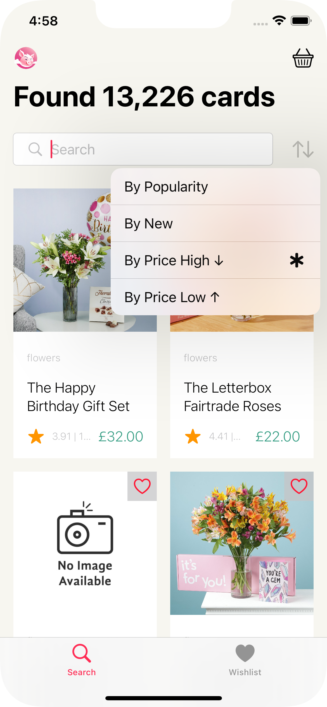
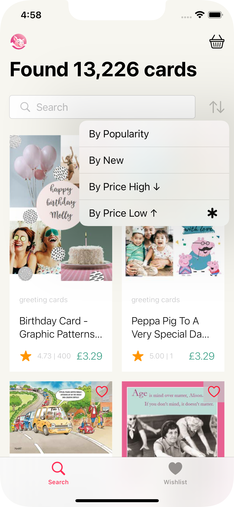
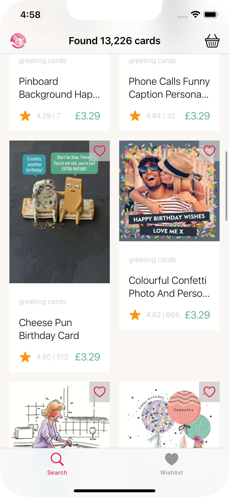
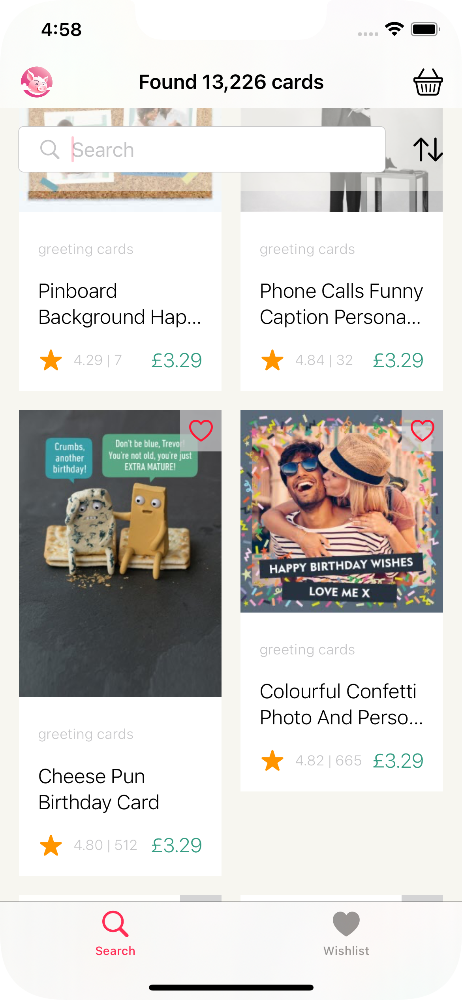

# Moonpig-Interview-Task
Moonpig Interview Task

## Structure
- I have chosen to use `MVVM` as it separates UI, data presentation, and business logic by utilizing a ViewModel to mediate the communication between the View and Model.
- I have broken the project into sections of the app such as Search (Homepage), Details (Item Details) and Checkout/Basket, each consisting of ViewModels & Views corresponding to the page.
    - Unfortunatelly because of time constraints I wasn't able to implement the other pages.
- I have an `Infrastructure` folder which contains files such as AppDelegate, BaseClasses, Navigation, Notifications, Utils etc.
- I have moved the `services` into their own target to keep it away from the main application and not clutter the main project.
- I have chosen to use `SwiftUI` as it allows for faster development, though it has its downsides.
- I have implemented `DependencyInjection` for better mantainability and testability of the application.
    
## Services
- I have chosen to use `Combine` for a 2 reasons:
    1: Combine its already been out for a while and a lot of projects are already using it.
    2: The job required it and I wanted to showcase that I know how to use it (By no means am I an expert)
- I would've probably used `async/await` for this as it would have been far simpler and for what I had to do it would've been more than acceptable.
- Overall I would use Combine when dealing with more complex data streams and handling multiple publishers that need to be composed.

## What I would have done with more time:
- Better error handling
    - Errors and Crashes are something that should be caught either by using something like Firebase Analytics or Sentry
    - Currently other than displaying an image nothing is different, they can pull to refresh but an alert would be more appropriate as it could tell them what the problem is.
- Tests
    - In an actual app I would've used a framwork such as Mockingbird to create mocks of each service rather than make them myself.
    - Add some tests for service itself not just the ViewModel
    - Isolating the views from triggering `onAppear` functionality when running `UnitTests` (using EnvironmentVariables)
    - Writing Snapshot Tests:
        - I would've created some snapshots tests as a simple and quick way of checking that everything is looks good.
        - Decided not to as they can be a bit tempermental from my experience and I have personally removed it from the build & test pipeline, it has its own test pipeline which I check whenever it fails as just a simple iOS or XCode version could to break it.
    - Writing UITests would be a must in order to verify the flow of the app is still functioning and nothing has been missed or broken during development and it would help a lot with regresion tests.
- Development
    - I would've added a details page showing more details about each product.
    - I would've added a local database for the basket so people can come back later to finish their purchase.
    - Search up `WhatNext` to see how some parts of the app would've been handled with more time and if this would've been a real project.
    - I haven't implemented it but for navigation I could've used Coordinators and ended up following the `MVVM-C` pattern.
    - In an actual application I would think about `accessibility` as well and the less fortunate and how to better help them navigate the app.
    
## Limited Development
- I will not deny that the design took a lot longer than I wanted it to, I went through 3 different itterations.
- Unfortunatelly because of some personal matters I wasn't able to dedicate as much time to the project as I initialy intended and so I wasn't able to provide the details and a checkout/basket page.

### PS:
- I have missed the requirement about the `Source control management` and I didn't push the changes regularly, I have added a screenshots of one of my personal projects and the git history of it. I am not sure what you were trying to look for `Proper title`, `Naming conventions` or `Good descriptions` but I forgot so hopefully the screenshot will help a bit.
    - The process that I use is: I create a PR with a proper title, description and PBI assigned to it.
    - I created a CI/CD pipeline for my personal project and part of it I am running the UnitTests and Snapshot Tests (The snapshot ones are not part of the build).
- I hope I haven't missed anything :D

## Screenshots
|   |   |   |
| ----------------------- | ----------------------- | ----------------------- |
|   |   |   |
|   |   |                         |
